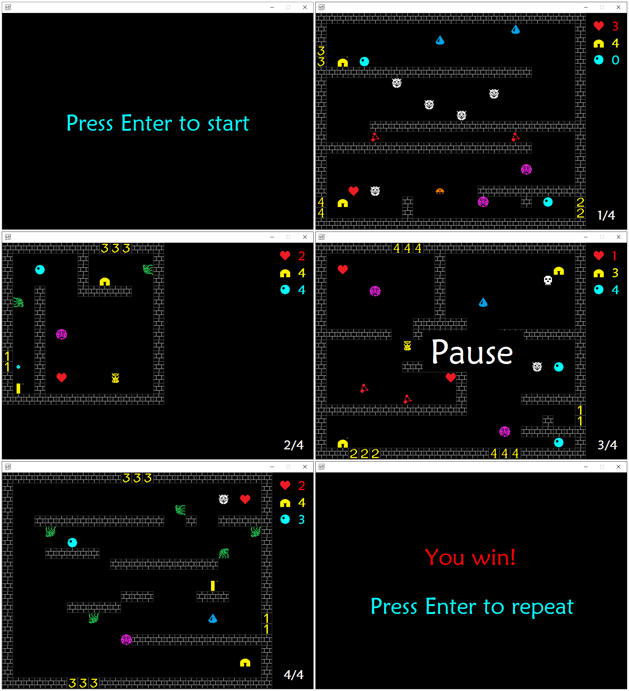

# Frost Byte

## Introduction

A .NET implementation of the single-player arcade game heavily inspired by
ZX Spectrum [FrostByte](https://spectrumcomputing.co.uk/entry/1894/ZX-Spectrum/Frost_Byte).

## Gameplay

You control the `Hero`, yellow twisted rectangle with small cross in the
upper right corner. `Hero` has `Hearts` (amount shall not drop below **1**,
otherwise lose) and `Bullets` (use them to fight with enemies).

The object of the game is to collect all friends of the `Hero` captured by the
enemies. `Friends` look like the `Hero`, but don't have yellow cross above.

Press `Enter` key button to start the game and to repeat it after final state
is achieved. Final states are considered either win or lose. The game could be
paused at any time by pressing `Pause` button and resumed by repeated
pressing. The player could exit the game by pressing `Esc`.

The `Hero` moves upon pressing `Left` or `Right`. It could jump, press `Up`.
Jump is interrupted upon `Left`, `Right` or `Down`. The `Hero` falls until
floor is reached. The `Hero` fires if has bullets, use `w`, `a`, `s` or `d`.
If the bullet reaches an enemy, the enemy disappears.

The game is a multi-level maze with enemies. Use portals to reach another
levels. Portals are wall blocks with numbers on it. There are several kinds of
enemies. Collision of the `Hero` and any enemy reduces amount of `Hearts` by
one. Moves of a `Jellyfish` are randomized, other enemies move in a well
defined directions. The `Skull` is very dangerous, it jumps onto the `Hero`
with probability **0.2** if a bullet or the `Hero` itself is detected near the
`Skull`.
