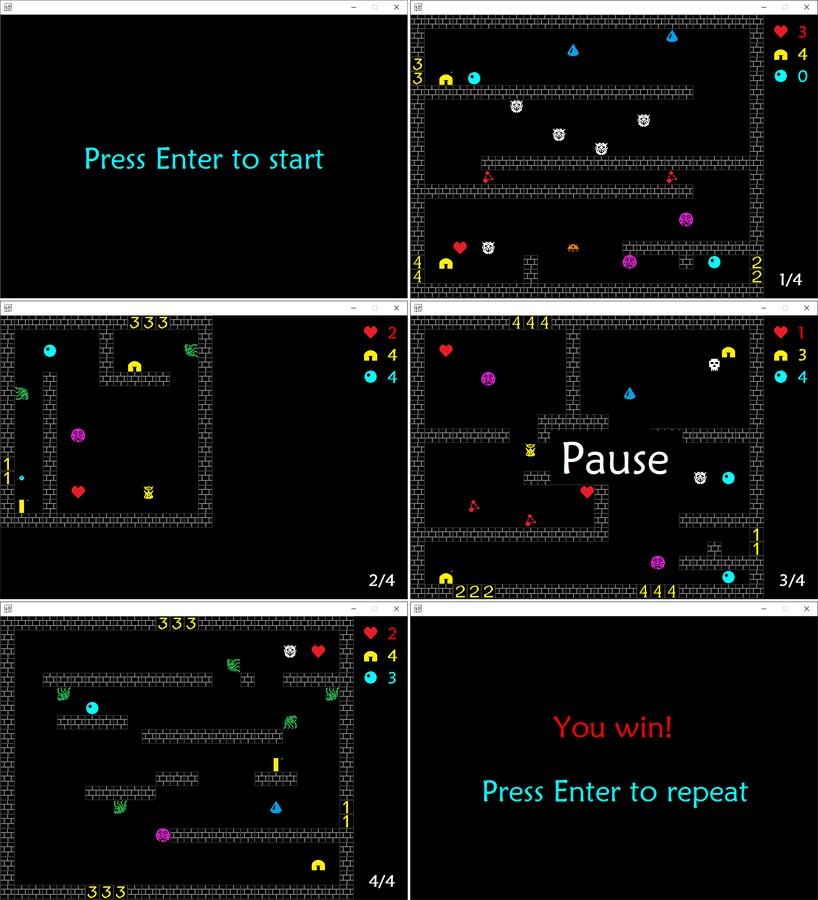

# Frost Byte

A `.NET` implementation of the single-player arcade game inspired by ZX Spectrum
[Frost Byte](https://spectrumcomputing.co.uk/entry/1894/ZX-Spectrum/Frost_Byte).

# Build and run

`dotnet-6.0.300` is supposed to be installed on the target system. Navigate to
the folder, where game should be stored and run the following commands.

```console
git clone 
cd FrostByte
dotnet run --project .\FrostByte\FrostByte.csproj
```

# Gameplay

The game implementes old-style pixel-oriented user interface. The meaning of
each possible tile and the rules of the game are described below.

You control the `Hero` , yellow twisted
rectangle with small cross in the upper right corner. The `Hero` moves upon
pressing `Left` and `Right` in a respective directions. It jumps on `Up`.
Jump is interrupted upon `Left`, `Right` or `Down`. The `Hero` falls unless
floor is reached.

The aim of the game is to save (collect) all `Friends`
 from captivity by enemies. The
remaining amount of captured friends is listed in the control panel on the right. |


The `Hero` has `Hearts` (amount shall not drop below **1**, otherwise loss)
and `Bullets` (use it to fight enemies).

The game could be paused and resumed at any time by pressing `Pause` button and resumed by repeated
pressing. The player could exit the game by pressing `Esc`.


Use `w`, `a`, `s` or `d` to let the `Hero` fire in a respective direction.
If a bullet reaches an enemy, the enemy disappears.

The game is a multi-level maze with enemies. Use portals to reach another
levels. Portals are tile with numbers on it, from **1** to **4**.

There are several kinds of enemies.

Collision of the `Hero` and any enemy reduces amount of `Hearts` by one.

Moves of a `Jellyfish` are randomized, other
species move in a well defined directions. The `Skull` is very dangerous, it
jumps onto the `Hero` with probability **0.2** if a bullet or the `Hero`
itself is detected near a `Skull`.


