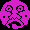
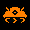
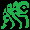

# Frost Byte

A `.NET` implementation of the single-player arcade game inspired by ZX Spectrum
[Frost Byte](https://spectrumcomputing.co.uk/entry/1894/ZX-Spectrum/Frost_Byte).

# Dependencies

The following programs are supposed to be installed on the target system.

- `dotnet-6.0.300`

# Build and run

Execute the following sequence of commands.

```console
git clone https://github.com/zhukovdm/FrostByte.git
cd FrostByte && dotnet run --project .\FrostByte\FrostByte.csproj
```

# Gameplay

The game implementes old-style pixel-oriented user interface. The meaning of
each possible tile and the rules of the game are described below.

Tiles  and 
represent empty space and a wall respectively.

You control the `Hero` , yellow twisted
rectangle with small cross in the upper right corner. The `Hero` moves upon
pressing `Left` and `Right` in a respective directions. It jumps on `Up`.
Jump is interrupted upon `Left`, `Right` or `Down`. The `Hero` falls unless
floor is reached.

The aim of the game is to save (collect) all `Friends`
 from captivity by enemies. The
remaining amount of captured friends is listed in the control panel on the
right.

The game proceeds as long as there are friends in captivity and the `Hero` has
`hearts` . Collision with an enemy decreases
the amount of `hearts` by **1**. On contrary, collected `heart` increments total
amount of `hearts` by **1**. If `heart` count drops to **0**, the game is lost.

The `Hero` has `bullets`  to fight
enemies. Use `w`, `a`, `s` or `d` to let the `Hero` fire a bullet in a respective
direction. If a bullet collide with an enemy, the enemy disappears.

The game is a multi-level maze. Use portals to reach another levels. Portals
are tile with numbers on it, e.g. .

The game could be paused and resumed via `Pause` button. The player could exit
the game by pressing `Esc`.

There are several kinds of enemies with different behavior.

| Picture | Description |
|---|---|
|  | `Tongue` moves in the horizontal direction. If wall or portal is met, the `tongue` changes its moving direction to opposite. |
|  | `Gremlin` behaves similar to a `Tongue`, but in vertical directions. |
|  | `Alien` behaves similar to a `Tongue`, but in diagonal directions. |
|  | `Triangle` moves in a horizontal direction until a wall or portal is reached. Then it appears next to the nearest obstacle in opposite direction and keeps moving. |
|  | `Water drop` behaves similar to a `Triangle`, but in vertical directions. |
|  | Moves of a `Jellyfish` could be in any direction and selected at random. |
|  | `Skull` doesn't move, but waits. If a bullet or the `Hero` itself is detected near a `Skull`, it jumps onto the `Hero` with **0.2** probability. |
|  | `Monster` moves alongside the floor in a selected direction. |


